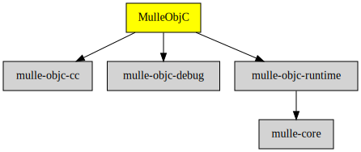

# MulleObjC

#### 💎 A collection of Objective-C root classes for mulle-objc

MulleObjC supplies the most basic runtime components like NSObject or NSThread
to build a foundation on top of it. MulleObjC depends on standard C libraries 
only and for instance not on `<unistd.h>`.


| Release Version                                       | Release Notes
|-------------------------------------------------------|--------------
|  [](//github.com/mulle-objc/MulleObjC/actions) | [RELEASENOTES](RELEASENOTES.md) |


## API

### Classes

* NSAutoreleasePool - garbage collection
* NSObject - the root class of everything
* NSInvocation - method call serialization
* NSMethodSignature - method description
* NSProxy - the other root class of everything :=)
* NSThread - threads

### Protocol and Protocolclasses

* NSCoding - object serialization
* NSCopying - object copying
* NSFastEnumeration  - support for `for ... in` loops
* NSLocking  - support for `for ... in` loops
* NSObject - for objects that don't want to behave like NSObject but can't be them
* MulleObjCClassCluster - enables classes to act as class clusters
* MulleObjCException - enabled a class to act as an exception
* MulleObjCRuntimeObject - documents the minimum required id superset
* MulleObjCSingleton - enables classes to produce singletons
* MulleObjCTaggedPointer - enables classes to use tagged pointers

### Functions

* `mulle_printf` and variants


It does all the interfacing with the **mulle-objc** runtime. Any
library code above MulleObjC ideally, should not be using the mulle-objc runtime
directly. Creating a foundation on top of **mulle-objc**  without using
**MulleObjC** is a foolhardy endeavor IMO.

MulleObjC must be compiled with the **mulle-clang** compiler, or a compiler
which supports the metaABI required for the mulle-objc runtime.


### You are here




## Requirements

|   Requirement         | Release Version  | Description
|-----------------------|------------------|---------------
| [mulle-objc-runtime](https://github.com/mulle-objc/mulle-objc-runtime) |  [](https://github.com/mulle-objc/mulle-objc-runtime/actions/workflows/mulle-sde-ci.yml) | ⏩ A fast, portable Objective-C runtime written 100% in C11
| [mulle-objc-debug](https://github.com/mulle-objc/mulle-objc-debug) |  [](https://github.com/mulle-objc/mulle-objc-debug/actions/workflows/mulle-sde-ci.yml) | 🐞 Debug support for the mulle-objc-runtime
| [mulle-objc-cc](https://github.com/mulle-cc/mulle-objc-cc) |  [](https://github.com/mulle-cc/mulle-objc-cc/actions/workflows/mulle-sde-ci.yml) | ⏩ make mulle-clang the default Objective-C compiler
| [mulle-objc-list](https://github.com/mulle-objc/mulle-objc-list) |  [](https://github.com/mulle-objc/mulle-objc-list/actions/workflows/mulle-sde-ci.yml) | 📒 Lists mulle-objc runtime information contained in executables.


## Add

Use [mulle-sde](//github.com/mulle-sde) to add MulleObjC to your project.
As long as your sources are using `#import "import-private.h"` and your headers use `#import "import.h"`, there will nothing more to do:

``` sh
mulle-sde add github:mulle-objc/MulleObjC
```

To only add the sources of MulleObjC with dependency
sources use [clib](https://github.com/clibs/clib):

## Legacy adds

One common denominator is that you will likely have to add
`#import <MulleObjC/MulleObjC.h>` to your source files.


### Add sources to your project with clib

``` sh
clib install --out src/mulle-objc mulle-objc/MulleObjC
```

Add `-isystem src/mulle-objc` to your `CFLAGS` and compile all the
sources that were downloaded with your project. (In **cmake** add
`include_directories( BEFORE SYSTEM src/mulle-objc)` to your `CMakeLists.txt`
file).


### Add as subproject with cmake and git

``` bash
git submodule add -f --name "mulle-core" \
                            "https://github.com/mulle-core/mulle-core.git" \
                            "stash/mulle-core"
git submodule add -f --name "mulle-objc-runtime" \
                            "https://github.com/mulle-objc/mulle-objc-runtime.git" \
                            "stash/mulle-objc-runtime"
git submodule add -f --name "mulle-objc-debug" \
                            "https://github.com/mulle-objc/mulle-objc-debug.git" \
                            "stash/mulle-objc-debug"
git submodule add -f --name "MulleObjC" \
                            "https://github.com/mulle-objc/MulleObjC" \
                            "stash/MulleObjC"
git submodule update --init --recursive
```

``` cmake
add_subdirectory( stash/MulleObjC)
add_subdirectory( stash/mulle-objc-debug)
add_subdirectory( stash/mulle-objc-runtime)
add_subdirectory( stash/mulle-core)

target_link_libraries( ${PROJECT_NAME} PUBLIC MulleObjC)
target_link_libraries( ${PROJECT_NAME} PUBLIC mulle-objc-debug)
target_link_libraries( ${PROJECT_NAME} PUBLIC mulle-objc-runtime)
target_link_libraries( ${PROJECT_NAME} PUBLIC mulle-core)
```


## Install

### Install with mulle-sde

Use [mulle-sde](//github.com/mulle-sde) to build and install MulleObjC and all dependencies:

``` sh
mulle-sde install --prefix /usr/local \
   https://github.com/mulle-objc/MulleObjC/archive/latest.tar.gz
```

### Manual Installation

Install the [Requirements](#Requirements) and then
install **MulleObjC** with [cmake](https://cmake.org):

``` sh
cmake -B build \
      -DCMAKE_INSTALL_PREFIX=/usr/local \
      -DCMAKE_PREFIX_PATH=/usr/local \
      -DCMAKE_BUILD_TYPE=Release &&
cmake --build build --config Release &&
cmake --install build --config Release
```


## Author

[Nat!](https://mulle-kybernetik.com/weblog) for Mulle kybernetiK  


