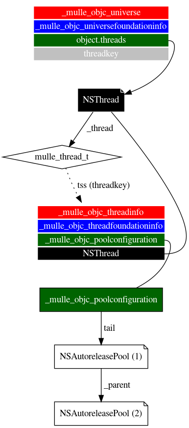

## Threads

// DRAFT

### NSThread

As `NSThread` is an Objective-C object, it should be discoverable via the
universe. It is stored separate from the root objects. Threads (not NSThread)
are the sole owners of `NSAutoreleasePool` instances.

The NSThread is stored (and retained) in thread local storage of each thread.

### NSAutoreleasePool

Every thread owns a stack of `NSAutoreleasePool`s. This stack is stored in a
thread local variable space of type `struct _mulle_objc_threadfoundationinfo`,
that is managed by the universe.

### -currentThread

The NSThread object is also stored in thread local storage. It is accessed via
`_mulle_objc_thread_set_threadobject` and
`_mulle_objc_thread_get_threadobject`.

